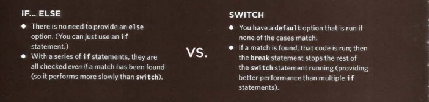

# HTML lists:

HTML provide 3 types of lists:

## 1. Ordered list

in this list each item inside it will have a number.

**How to make an ordered list**

first of all you will write < ol > this means that you creat an ordered list after that you will write for each item inside the list < li > and < /li > after you finish the items you will close the list with a closing tag < /ol >

click on [image](https://stacktips.com/wp-content/uploads/2014/05/Ordered-List-Example.png) to see an example

## 2.  Unordered list 

in this list it will begin with a bullet point (rather than characters that indicate order).

**How to make unordered list**

first of all you will write < ul > this means that you creat an ordered list after that you will write for each item inside the list < li > and < /li > after you finish the items you will close the list with a closing tag < /ul >

click on [image](https://www.dummies.com/wp-content/uploads/412158.image0.jpg) to see an example

## 3. Definition list 

These lists are used to made up of a set of terms along with the definitions for each of those terms.

**How to make definition list**

first of all you have to write < d1 > tag inside this tage you will see the < dt > tag and < dd > the dt tag used to contain the term being defined (the definition term). and the dd tag used to contaion the definition.

click on [image](https://www.dummies.com/wp-content/uploads/398569.image0.jpg) to see an example.

## You can make another list inside a list this is called *nested lists*  click on [image](https://i.stack.imgur.com/bjuI6.png) to see an example

# Boxes
each HTML element are treated on CSS as if it lives in its own box 

## How to control the size of the boxes

By default a box is sized just big enough to hold its contents. To set your own dimensions for a box you can use the height and width properties. width and height are usually defined by pixels but you can also use percentages or ems.

## How to limit the box size 
**To limit the width** you will use min-width property which specifies the smallest size a box can be displayed at when the browser window is narrow, and the max-width property indicates the maximum width a box can stretch to when the browser window is wide.

**To limit the height** you will use min-height and max-height property.

# Over flow content:
The overflow property tells the browser what to do if the content contained within a box is larger than the box itself. there is two ways:

1. hidden
This property simply hides any extra content that does not fit in the box.

2. scroll
This property adds a scrollbar to the box so that users can scroll.

# Box propirties:
every box have three propirties that can be adjusted to control its appearance: border,margin,padding

## For borders you can set this properties :

1. border-width :
to control the width of a bordet 

2. border-style :
to define the style of the border if it's solid dashed,etc

3. border color :
to define the color of a border

## for padding:
The padding property allows you to specify how much space should appear between the content of an element and its border.  you can You can specify different values for each side of a box using:padding-top,padding-right,padding-bottom,padding-left.

## For margins:
The margin property controls the gap between boxes. You can specify values for each side of a box using:margin-top,margin-right,margin-bottom,margin-left.

# Display 
The display property allows you to turn an inline element into a block-level element or vice versa, and can also be used to hide an element from the page.

# CSS3: Border Images
this property applies an image to the border of any box. It takes a background image and slices it into nine pieces. 
This property requires three pieces of information:
1. The URL of the image

2. Where to slice the image

3. What to do with the straight

edges; the possible values are: stretch stretches the image,repeat repeats the image,round like repeat but if the tiles do not fit exactly, scales the tile image so they will.

# CSS3: Box Shadows
This  property allows you to add a drop shadow around a box. to make it you It must use at least the first of these twovalues as well as a color:
**Horizontal offset**
Negative values position thehadow to the left of the box.
**Vertical offset**
Negative values position the shadow to the top of the box.
**Blur distance**
If omitted, the shadow is a solid line like a border.
**Spread of shadow**
If used, a positive value willcause the shadow to expand in all directions, and a negative value will make it contract.

# CSS3: Rounded Corners
Its the ability to create rounded corners on anybox.
You can specify individual values
for each corner of a box using:
border-top-right-radius , border-bottom-right-radius , border-bottom-left-radius , border-top-left-radius

# JS 
## Swith statements
 A switch statement allows a variable to be tested for equality against a list of values. Each value is called a case, and the variable being switched on is checked for each switch case.

 ## How its work?
- If there is a match, the corresponding statements after the matching label are executed.
-If there is no match, the default statements are executed.
**Note:**If we do not use break, all statements after the matching label are executed.
 click on [image](https://www.plantation-productions.com/Webster/www.artofasm.com/Linux/HTML/images/AdvancedCtrlStructures6.gif) to see the switch syntax 

 ## Comparing between switch and if statements

## loops:
loops are used to repeatedly run a block of code - until a certain condition is met.

## loops types:
1. For loop : it is used to run code a specific number of times.
2. While loop : it is used if you don't know many times the code should be run.
3. Do while loops: The key difference between a while loop and a do while
loop is that the statements in the code block come before the condition. This means that those statements are run once whether or not the condition is met. 

### For loop syntax:

click on [image](https://www.w3resource.com/w3r_images/c-for-statement.png)

### While loop syntax:

click on [image](https://www.decodejava.com/python-while-loop.png)

### While do syntax

click on [image](https://media.geeksforgeeks.org/wp-content/uploads/20191118154342/do-while-Loop-GeeksforGeeks2.jpg)

