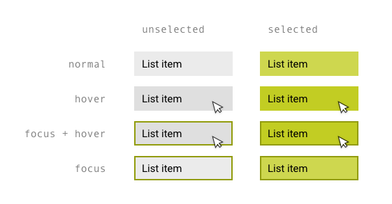

# Images in HTML
first of all before starting to add images you have to know that there is a copyrights for the images so be careful about this. *steps to add images:*
## 1. Storing images on your site 
after you pick your images If you are building a site from scratch, it is good practice to create a folder for all of the images the site uses,On a big site you might like to add subfolders inside the images
folder to be more organized.

## 2. Adding images 
To add an image into the page you need to use an < img > element. This is an empty element (which means there is no closing tag). It must carry the following two attributes:

- src : This tells the browser where it can find the image file. This will usually be a relative URL pointing to an image on your own site

- alt:This provides a text descriptionof the image which describes theimage if you cannot see it.

- title: You can also use the title attribute with the < img > element to provide additional information
about the image.

 *Note:* to control the height and width of the images you can add it inside the < img > after choosing the image

## How to align images in old code
The align attribute was commonly used to indicate how the other parts of a page should flow around an image. It has been removed from HTML5 and new websites should use CSS to control the alignment of images .
**Horizontal values for align attributes:**
- left:This aligns the image to the left (allowing text to flow around its right-hand side).

- right: This aligns the image to the right (allowing text to flow around its left-hand side).

**Verical values for align attributes:**
- top :This aligns the first line of the surrounding text with the top of the image.
- middle :This aligns the first line of the surrounding text with the middle of the image.
- bottom :This aligns the first line of the surrounding text with the bottom of the image

# Three rules for creating images :
**1. Save images in the right format**
**2. Save images in the right size.**
**3. Use the correct resolution.**

### Vector images:
Vector images differ from bitmap images and are resolution-independent. Vector images are commonly created in programs such as Adobe Illustrator.

### Animated GIFs
Animated GIFs show several frames of an image in sequence and therefore can be used to create simple animations.

### Transparency
Creating an image that is partially transparent (or "see-through") for the web involves selecting one of two formats:
- Transparent GIF:If the transparent part of the image has straight edges and it is 100% transparent (that is,
not semi-opaque), you can save the image as a GIF (with the transparency option selected).
- PNG:If the transparent part of the image has diagonal or rounded edges or if you want a semiopaque transparency or a dropshadow, then you will need to save it as a PNG.

### HTML5: figure and figure caption
**The figure** element helps you  to contain images and their caption so that the two are associated.
You can have more than one image inside the < figure > element as long as they all share the same caption.

**figcaption**
The figcaption element hasbeen added to HTML5 in order to allow web page authors to add a caption to an image.

# Colors 
The color property allows you to specify the color of text inside an element.

## There is three ways to specify colors in CSS:
**1. rgb values.**

These express colors in terms of how much red, green and blue are used to make it up. For example: rgb(100,100,90).

**2.  hex codes.**

These are six-digit codes that represent the amount of red,green and blue in a color,preceded by a pound or hash sign. 

**3. color names.**
There are 147 predefined color names that are recognized by browsers. 

**Notes: When picking foreground and background colors, it is important to ensure that there is enough contrast for the text to be legible.**

# CSS3 
## Opacity:
CSS3 introduces the opacity property which allows you to specify the opacity of an element and any of its child elements. The value is a number between 0.0 and 1.0 (so a value of 0.5 is 50% opacity and 0.15 is 15% opacity).

## HSL colors
CSS3 introduces an entirely new and intuitive way to specify colors using :
- Hue is the colloquial idea of color
- saturation is the amount of gray in a color. 
- lightness values  is the amount of white (lightness) or black (darkness) in a color.

# How to conrol your text
## Ways to change  text font ( type face)
**1. font-family,** The value of this property is the name of the typeface you want to use. 

**2. @font-face,** allows you to use a font, even if it is not installed on the computer of the person browsing. to apply this you have to follow these steps:
- font-family :This specifies the name of the font. This name can then be used as a value of the font-family property in the rest of the style sheet.
- src: This specifies the path to the font. In order for this technique to work in all browsers, you will probably need to specify paths to a few different versions of the font.
- format : This specifies the format that the font is supplied in.

## Ways to change propertis for text:
**1. font-size**

 to specify a size for the font. the most common ways to specify the size:pixels,percentages,ems.

**2. font-weight**

 allows you to create bold text.There are two values that this property commonly takes: normal,bold.

 **3. font-style**

 If you want to create italic text, you can use the font-style property. There are three values this property can take:normal,italic,oblique.

 **4. text-transform**

 The text-transform property is used to change the case of text giving it one of the following values:uppercase.lowercase,capitalize.

 **5. text-decoration**

click on [image](https://s3.amazonaws.com/webucator-how-tos/2288.png)  to see the types .

**6. line-height**

is a term typographers use for the vertical space between lines of text.

**7. letter and word spacing** 

letter-spacing:it's used to control the spaces between letters.

word-spacing: it's used to control the spaces between words.

**8. text-align**

allows you to control the alignment of text. The property can take one of four values:left,right,center,justify.

**9. text-indent**

The text-indent property allows you to indent the first line of text within an element.The amount you want the line indented by can be specified in a number of ways but is usually given in pixels or ems.

**10. text shadow** 

It is used to create a drop shadow, which is a dark version of the word just behind it and slightly offset. It can also be used to create an embossed effect by adding a shadow that is slightly lighter than the text.
**How to make text shadow:** you have to define four three lengths and a color the first length indicates how
far to the left or right the shadow
should fall.The second value indicates the distance to the top or bottom that the shadow should fall.The third value is optional and specifies the amount of blur that should be applied to the drop shadow.The fourth value is the color of the drop shadow.

**11. first letter or line**

You can specify different values for the first letter or first line of text inside an element using :first-letter and :first-line

## Styling links
Browsers tend to show links in blue with an underline by default, and they will change the color of links that have been visited to help users know which pages they have been to. to style the linksthere are two things you can make it :
 - link: This allows you to set styles for links that have not yet beenvisited. 
 - visited: This allows you to set styles for links that have been clicked on.  

 ## Effects that respond to users interacts:
**1. :hover**
 This is applied when a user hovers over an element with a pointing device such as a mouse.

 **2. :active**
 This is applied when an element is being activated by a user.

 **3. :focus**
This is applied when an element has focus. Any element that you can interact with, such as a link you can click on or any form control can have focus.

here is an image to see how they applied

