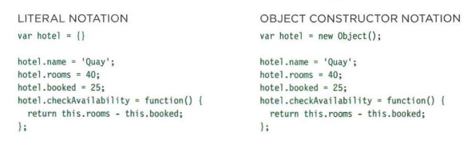
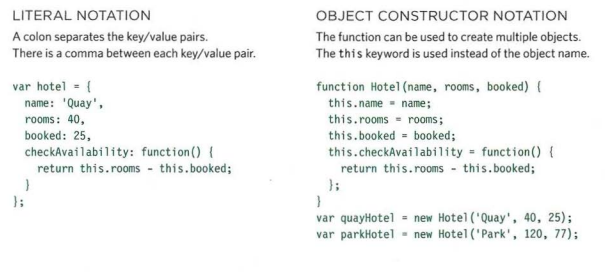

# Domain modeling
Domain modeling is the process of creating a conceptual model in code for a specific problem.A domain model that's articulated well can verify and validate the understanding of a specific problem among various stakeholders. As a communication tool, it defines a vocabulary that can be used within and between both technical and business teams.

# Define a constructor and initialize properties
**Benefit:**To define the same properties between many objects

## Epic fail object

Property | Data | Type
------------ | ------------- |----------- |
epicRating   |  1 to 10      | Number     |
hasAnimals   | true or false | Boolean    |

The constructor function is defined using a function expression. In other words, the variable EpicFailVideo is declared and then assigned a function with two parameters called epicRating and hasAnimals.
When the function is called, the data inside these parameters are stored inside the this.epicRating and this.hasAnimals properties respectively. Storing data within properties ensures any newly created object can access that data later.
After the constructor function definition, two objects are instantiated with the new keyword and their properties are initialized by calling the EpicFailVideo constructor function. After being instantiated and initialized, these objects are stored inside the parkourFail and corgiFail variables.

## Generate random numbers
To model the random nature of user behavior, you'll need the help of a random number generator. Fortunately, the JavaScript standard library includes a Math.random() function for just this sort of occasion.

# Steps to follow when building your own domain models:
Here's some tips to follow when building your own domain models.

1. When modeling a single entity that'll have many instances, build self-contained objects with the same attributes and behaviors.

2. Model its attributes with a constructor function that defines and initializes properties.

3. Model its behaviors with small methods that focus on doing one job well.

4. Create instances using the new keyword followed by a call to a constructor function.

5. Store the newly created object in a variable so you can access its properties and methods from outside.

6. Use the this variable within methods so you can access the object's properties and methods from inside.

# Tables in HTML

*What's a table?* A table represents information in a grid format.Examples of tables include financial reports, TV schedules, and sports results.

## Basic table Structure

- < table > used to create table 
- < tr > indicate the start of each row using the opening < tr > tag.  
- < td > Each cell of a table is represented using a < td > element. (The td stands for table data.)

## Table Headings
The < th > element is used just like the < td > element but its purpose is to represent the heading for either a column or a row. (The th stands for table heading.) 

## Spanning Column

*Why we use it ?*  sometimes you may need the entries in a table to stretch across more than one column.

*Where to use it:* the colspan attribute can be used on a < th > or < td > element and indicates how many columns that cell should across

click on [image](https://abhiandroid.com/ui/wp-content/uploads/2016/05/Row-and-Column-in-Table-Layout-Android.jpg) to see an exapmle 

## Spanning Rows

*Why we use it ?* You may need entries in a table to stretch down across more than one row.

*Where to use it:* The rowspan attribute can be used on a < th > or < td > element to indicate how many rows a cell should span down the table.

# Long tables

There are three elements that help distinguish between the main content of the table and the first and last rows (which can contain different content).

- < thead > The headings of the table should sit inside the < thead > element. 
- < tbbody > The body should sit inside the < tbody > element. 
- < tfoot > The footer belongs inside the < tfoot > element.

# javaScript
# Creating an object constructuin notation

**Firts:** create a new object using a combination of the new keyword and the object() constructor function 

**Second:** having created the blank object you can add properties and methods to it using dot notation.

## How to update an object 

to update the value of properties use dot notation or square brackets ex: hotel.name='park'
**hotel** is the object **dot** is member operator **name** is property name **park** is property value

## Creating many objects constructor notation 
sometimes you need several objects to represent similar things. object constructors can use function as a template for creating objects.
to create it first you have to create the template with the object's properties and methods 
then the new keyword followed be a call to the function creates a new object.

# Ways to create objects

1. Creats the object then add proprties and methods

2. Creating an object wit properties and methods

# This key word 
The keyword this is commonly used inside functions and objects.Where the function is declared alters what this means. It always refers to one object, usually the object in which the function operates. 

# Storing Data 
In JavaScript, data is represented using name/value pairs.To organize your data, you can use an array or object to group a set of related values. In arrays and objects the name is also known as a key. 

# What are built in object 

Browsers come with a set of built-in objects that represent things like the browser window and the current web page shown in that window. These built-in objects act like a toolkit for creating interactive web pages. 
