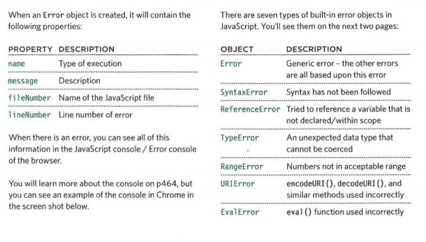

# Error Handling & Debugging
In this page you will find ways to find were is your error. 
## ORDER OF EXECUTION 
To find the source of an error, it helps to know how scripts are processed.The order in which statements are executed can be complex; some tasks cannot complete until another statement or function has been run.

## EXECUTION CONTEXTS 
The JavaScript interpreter uses the concept of execution contexts.There is one global execution context; plus, each function creates a new execution context. They correspond to variable scope. 

**Every statement in a script lives in one of three execution contexts:**
**1. GLOBAL CONTEXT:**
Code that is in the script, but not in a function.
There is only one global context in any page.
**2. FUNCTION CONTEXT:**
Code that is being run within a function.Each function has its own function context.
**3. EVAL CONTEXT:**
Text is executed like code in an internal function called eval 

## What happends when script enters a new execution context?
**Phase 1 Prepare**
• The new scope is created

• Variables, functions, and arguments are created

• The value of the this keyword is determined 

**Phase 2 Execute**
• Now it can assign values to variables 

• Reference functions and run their code

• Execute statements 

## Understanding Scope

In the interpreter, each execution context has its own va ri ables object.It holds the variables, functions, and parameters available within it.Each execution context can also access its parent's variables object.If a JavaScript statement generates an error, then it throws an exception.At that point, the interpreter stops and looks for exception-handl ing code.  

## Error Objects

Error objects can help you find where your mistakes are and browsers have tools to help you read them.

## How to deal with errors

1. DEBUG THE SCRIPT TO FIX ERRORS

2. HANDLE ERRORS GRACEFULLY 

