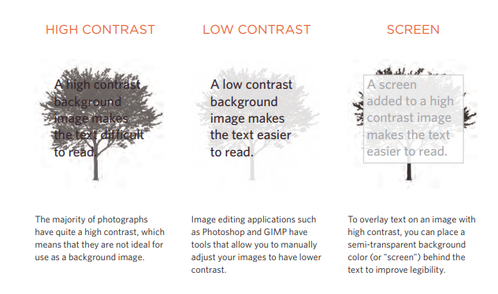

# Control images in CSS
## How to control the size of images using CSS?
You can control the size of an image using the width and height properties in CSS
## benefit of determing the size of images 
Specifying image sizes helps pages to load more smoothly because the HTML and CSS code will often load before the images, and telling the browser how much space to leave for an image allows it to render the rest of the page without waiting for the image to download.

## Aligning images using CSS 
to align images we use float property that is used to move an element to the left or the right of its containing block,allowing text to flow around it.

## Centering images using CSS
first of all you have to change the display from inline which is the defult for images to block element then there are two common ways in which you can horizontally center an image:
1.  On the containing element,you can use the text-align property with a value of center.
2. On the image itself, you can use the use the margin property and set the values of the left and right margins to auto

## Background images
The background-image property allows you to place an image behind any HTML element. This could be the entire page or just part of the page. By default, a background image will repeat to fill the entire box.
### Some properties to control the background images
- **Background repeat**
The background-repeat property can have four values:
a. repeat

The background image is repeated both horizontally and vertically

b. repeat-x
The image is repeated horizontally only.

c. repeat-y

The image is repeated vertically only.

d. no-repeat

The image is only shown once.

- **Background attachments**
it specifies whether a background image should stay in one position or move as the user scrolls up and down the page. It can have one of two values:

a. fixed
The background image stays in the same position on the page.

b. scroll
The background image moves up and down as the user scrolls up and down the page.

- **Background position**
This property can be used when the images not repeated it allows  to specify where in the browser window the background image should be placed. This property usually has a pair of values. The first represents the horizontal position and the second represents the vertical.If you only specify one value,the second value will default to center.

- **Background gradiants**
The gradient is created using the background-image property and, at the
time of writing,different browsers required a different syntax.

- **Background contrast**

# Practical information
## Search engine optimization (SEO)
Search engine optimization (SEO) is the practice of trying to help your site appear nearer the top of search engine results when people look for the topics that your website covers.
 
 **SEO is often split into two areas:**

**1.on-page techniques**

On-page techniques are the methods you can use on your web pages to
improve their rating in search engines.
 The main component of this is looking at keywords that people are likely to enter into a search engine if they wanted to find your site, and then including these in the text and HTML code for your site in order to help the search engines know that your site covers these topics.

 **2. Off-Page Techniques**

 Getting other sites to link to youis just as important as on-page techniques. Search engines help determine how to rank your site by looking at the number of other sites that link to yours.

 ### 7 Places where keywords can appear

 **1.  Page Title**

 The page title appears at the top of the browser window or on the
tab of a browser.

**2.  URL / Web Address**

The name of the file is part of the URL. Where possible, use keywords in the file name.

**3.  Headings**

If the keywords are in a heading < hn > element then a search engine will know that this page is all about that subject and give it greater weight than other text.
 
**4. Text**

**5. Link Text**

**6.  Image Alt Text**

**7. Page Descriptions**

## How to Identify Keywords and Phrases
Here are six steps that will help you identify the right keywords and phrases for your site

**1.  Brainstorm**

 List down the words that someone might type into Google to find your site. Be sure to include the various topics,products or services your site is about.

 **2. Organize**

 Group the keywords into separate lists for the different sections or categories of your website.

 **3. Research**

 There are several tools that let you enter your keywords andthen they  will suggest additional keywords you might like to consider, such as:
adwords.google.co.uk/select/KeywordToolExternal
(When using this tool, select the"exact match" option rather than
"broad match.")

**4.  Compare**

It is very unlikely that your site will appear at the top of the search results for every keyword. This is especially true for topics where there is a lot of competition. The more sites out there that have already been optimized for a given keyword,the harder it will be for you to rise up the search results when people search on that term.

**5. Refine**

Now you need to pick which keywords you will focus on.These should always be the ones that are most relevant to each section of your site If there is a phrase that is very relevant but you find there is a lot of competition, you should still use it. To improve the chances of your site being found you can look at whether there are other words that could be incorporated into a phrase.

**6.  Map**

Pick 3-5 keywords or phrases that map to each page of your website and use these as the keywords for each page.

