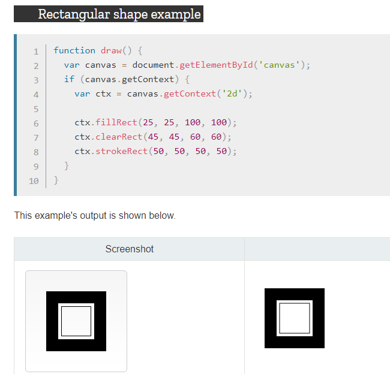
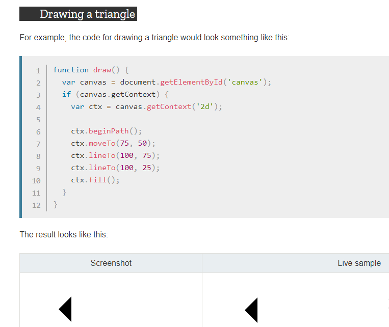

# Creating Charts 
## What is chart.js?
a JavaScript plugin that uses HTML5’s canvas element to draw the graph onto the page. It’s a well documented plugin that makes using all kinds of bar charts, line charts, pie charts and more, incredibly easy.

## Steps for making charts
1.  you have to install charts.js 

2. you  must write < canvas > element

## What is the canvas element 
canvas element are contaion two attributes width and height,these are both optional and if it's not specified they will initially be 300 pixels wide and 150 pixels high.The canvas element can be styled just like any normal image (margin, border, background…). These rules, however, don't affect the actual drawing on the canvas

## The rendering context

The canvas element creates a fixed-size drawing surface that exposes one or more rendering contexts, which are used to create and manipulate the content shown. 

The canvas is initially blank. To display something, a script first needs to access the rendering context and draw on it. The canvas element has a method called getContext(), used to obtain the rendering context and its drawing functions. getContext() takes one parameter, the type of context. For 2D graphics, you specify "2d" to get a CanvasRenderingContext2D.

## Drawing shapes with canvas

**1. Drawing Rectangles**
There are three functions that draw rectangles on the canvas:

- fillRect(x, y, width, height)

Draws a filled rectangle.

- strokeRect(x, y, width, height)

Draws a rectangular outline.

- clearRect(x, y, width, height)

Clears the specified rectangular area, making it fully transparent.

**2. Drawing paths**

A path is a list of points, connected by segments of lines that can be of different shapes, curved or not, of different width and of different color.

### How to draw shapes using paths 

First, you create the path.Then you use drawing commands to draw into the path.Once the path has been created, you can stroke or fill the path to render it.

### Functions  that is used to draw using path 

**- beginPath()**

Creates a new path. Once created, future drawing commands are directed into the path and used to build the path up.

**- Path methods**

Methods to set different paths for objects.

**- closePath()**

Adds a straight line to the path, going to the start of the current sub-path.

**- stroke()**

Draws the shape by stroking its outline.

**- fill()**

Draws a solid shape by filling the path's content area.
 
 

 ### Moving the pen

 function: moveTo(x, y)

Moves the pen to the coordinates specified by x and y.

Uses:

When the canvas is initialized or beginPath() is called, you typically will want to use the moveTo() function to place the starting point somewhere else. We could also use moveTo() to draw unconnected paths.

### Drawing Lines
Function: lineTo(x, y)

Draws a line from the current drawing position to the position specified by x and y.

### Drawing Arcs
To draw arcs or circles, we use the arc() or arcTo() methods.

- arc(x, y, radius, startAngle, endAngle, anticlockwise)

Draws an arc which is centered at (x, y) position with radius r starting at startAngle and ending at endAngle going in the given direction indicated by anticlockwise (defaulting to clockwise).

- arcTo(x1, y1, x2, y2, radius)

Draws an arc with the given control points and radius, connected to the previous point by a straight line.

### Bezier and quadratic curves

- quadraticCurveTo(cp1x, cp1y, x, y)

Draws a quadratic Bézier curve from the current pen position to the end point specified by x and y, using the control point specified by cp1x and cp1y.

- bezierCurveTo(cp1x, cp1y, cp2x, cp2y, x, y)

Draws a cubic Bézier curve from the current pen position to the end point specified by x and y, using the control points specified by (cp1x, cp1y) and (cp2x, cp2y)

# Drawing Texts 
The canvas rendering context provides two methods to render text:

- fillText(text, x, y [, maxWidth])

Fills a given text at the given (x,y) position. Optionally with a maximum width to draw.

- strokeText(text, x, y [, maxWidth])

Strokes a given text at the given (x,y) position. Optionally with a maximum width to draw.

## Styling Texts

- font = value

The current text style being used when drawing text. This string uses the same syntax as the CSS font property. The default font is 10px sans-serif.

- textAlign = value

Text alignment setting. Possible values: start, end, left, right or center. The default value is start.

- textBaseline = value

Baseline alignment setting. Possible values: top, hanging, middle, alphabetic, ideographic, bottom. The default value is alphabetic.

- direction = value

Directionality. Possible values: ltr, rtl, inherit. The default value is inherit.

# Colors

- fillStyle = color

Sets the style used when filling shapes.

- strokeStyle = color

Sets the style for shapes' outlines.

# Transparency

- globalAlpha = transparencyValue

Applies the specified transparency value to all future shapes drawn on the canvas. The value must be between 0.0 (fully transparent) to 1.0 (fully opaque). This value is 1.0 (fully opaque) by default.

# Line Styles

There are several properties which allow us to style lines.

- lineWidth = value

Sets the width of lines drawn in the future.

- lineCap = type

Sets the appearance of the ends of lines.

- lineJoin = type

Sets the appearance of the "corners" where lines meet.
- miterLimit = value

Establishes a limit on the miter when two lines join at a sharp angle, to let you control how thick the junction becomes.

- getLineDash()

Returns the current line dash pattern array containing an even number of non-negative numbers.

- setLineDash(segments)

Sets the current line dash pattern.

- lineDashOffset = value

Specifies where to start a dash array on a line.

# Gradiants 

- createLinearGradient(x1, y1, x2, y2)

Creates a linear gradient object with a starting point of (x1, y1) and an end point of (x2, y2).

- createRadialGradient(x1, y1, r1, x2, y2, r2)

Creates a radial gradient. The parameters represent two circles, one with its center at (x1, y1) and a radius of r1, and the other with its center at (x2, y2) with a radius of r2

# Patterns

- createPattern(image, type)
Creates and returns a new canvas pattern object. image 

The type specifies how to use the image in order to create the pattern, and must be one of the following string values:

**- repeat**
Tiles the image in both vertical and horizontal directions.
**- repeat-x**
Tiles the image horizontally but not vertically.
**- repeat-y**
Tiles the image vertically but not horizontally.
**- no-repeat**
Doesn't tile the image. It's used only once.

# Shadows

Using shadows involves just four properties:

- shadowOffsetX = float

Indicates the horizontal distance the shadow should extend from the object. This value isn't affected by the transformation matrix. The default is 0.

- shadowOffsetY = float

Indicates the vertical distance the shadow should extend from the object. This value isn't affected by the transformation matrix. The default is 0.

- shadowBlur = float

Indicates the size of the blurring effect; this value doesn't correspond to a number of pixels and is not affected by the current transformation matrix. The default value is 0.

- shadowColor = color

A standard CSS color value indicating the color of the shadow effect; by default, it is fully-transparent black.